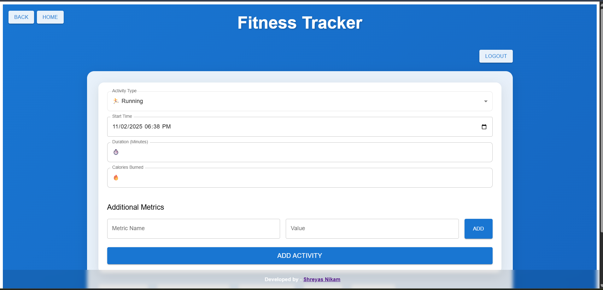
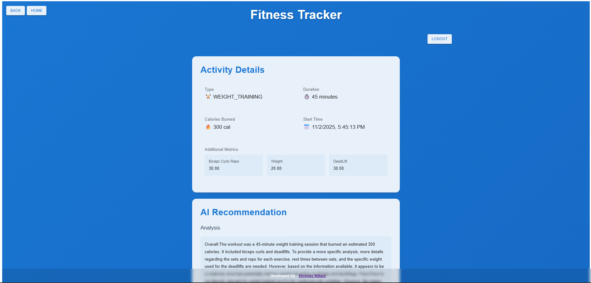
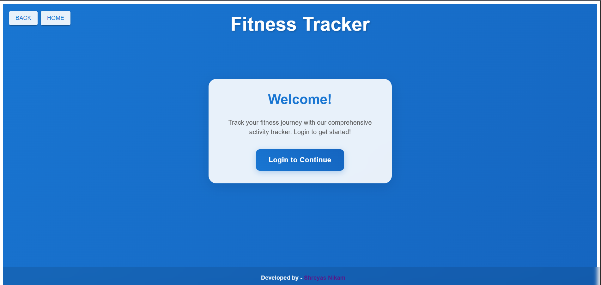

# 🏋️ Fitness Tracker Frontend

# 💪 Fitness Tracker Frontend

A modern, fast, and responsive **React + Vite** web interface for the Fitness Microservices Platform.  
It interacts with backend microservices via a secure **API Gateway**, providing dashboards, workout tracking, and AI recommendations.

---

## 🚀 **Features**
- 🏠 Dashboard to track user workouts and progress  
- 🤖 AI-powered recommendations fetched from AI Service  
- 🔐 OAuth2 / JWT-based authentication (via Keycloak)  
- ⚡ Built with Vite for blazing-fast dev experience  
- 🎨 Styled using Material UI / TailwindCSS  

---

## 🧰 **Tech Stack**

| Category | Technologies |
|-----------|---------------|
| Framework | React 18 + Vite |
| State Management | React Hooks / Redux Toolkit (if used) |
| Styling | TailwindCSS / Material UI |
| API | Axios |
| Routing | React Router DOM |
| Auth | Keycloak (OAuth2) |

## 🖼️ Screenshots

### 🏠 Home Page

### 📊 AI Recommendations

### 🔐 Login

